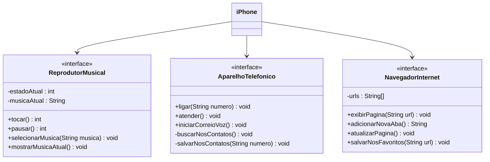

# Diagrama de Classe

```mermaid
classDiagram
    class ReprodutorMusical {
        -estadoAtual : int
        -musicaAtual : String
        +tocar()  int
        +pausar() int
        +selecionarMusica(String musica) void
        +mostrarMusicaAtual() void
    }
    <<interface>> ReprodutorMusical

    class AparelhoTelefonico {
        +ligar(String numero) void
        +atender() void
        +iniciarCorreioVoz() void
        -buscarNosContatos() void
        -salvarNosContatos(String numero) void
    }
    <<interface>> AparelhoTelefonico

    class NavegadorInternet {
        -urls : String[]
        +exibirPagina(String url) void
        +adicionarNovaAba() String
        +atualizarPagina() void
        +salvarNosFavoritos(String url) void
    }
    <<interface>> NavegadorInternet

    class iPhone 

    iPhone --> ReprodutorMusical
    iPhone --> AparelhoTelefonico
    iPhone --> NavegadorInternet
```
 - As classes `<<interface>>` possuem métodos abstratos